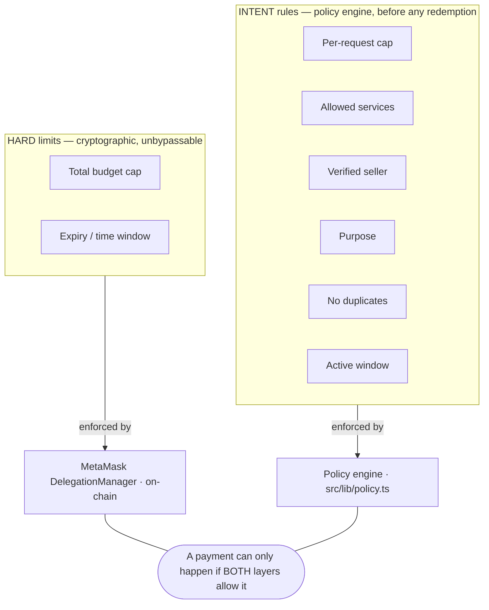

# 03 · Solution

> **Covenant** turns "give the agent a wallet" into "give the agent a *covenant*" — one user-signed
> spending policy that the agent operates inside, enforced where the agent cannot reach it.

## The covenant

A **covenant** is a single agreement the user signs once. Concretely it is an **ERC-7710 delegation**
from the user's **MetaMask Smart Account** to the agent's executor, plus the policy attached to it:

| The covenant says… | Enforced as |
| --- | --- |
| "Spend at most **N USDC** total." | On-chain caveat (`ERC20TransferAmountEnforcer`) |
| "Only **until** this time." | On-chain caveat (`TimestampEnforcer`) |
| "At most **M USDC per request**." | Off-chain policy (soft — user can approve a one-off override) |
| "Only these **services**." | Off-chain policy |
| "Only **verified** sellers." | Off-chain policy |
| "Only for this **purpose**." | Off-chain policy |
| "Never pay for the **same thing twice**." | Off-chain policy |
| "Only while the covenant is **active**." | Off-chain policy (+ expiry is also on-chain) |

Signing the covenant produces a **real EIP-712 signature** but moves **no money**. Funds stay in the
user's smart account. They only ever move when the agent makes a *specific, in-policy* payment — and even
then, the on-chain budget and expiry caveats put a ceiling the agent physically cannot exceed.

## How it resolves the tension

The problem ([§02](./02-problem.md)) was: *let it spend freely, but never spend wrongly.* Covenant
splits "wrongly" into two kinds of rule and enforces each where it belongs:

- **Hard limits live on-chain.** The budget cap and expiry are baked into the signed delegation. The
  `DelegationManager` rejects any redemption that would exceed the budget or happen after the window —
  *no matter what the agent or even our own server does*. This is the limit the agent cannot raise,
  because it is not enforced by the agent's software at all.
- **Intent rules live in a firewall.** A pure policy engine evaluates every payment *before* any
  redemption is attempted, against the finer covenant rules. If a rule fails, the payment is blocked and
  no transaction is ever built.

Within those two layers, the agent is **fully autonomous**: an ordinary, in-policy payment settles with
no human in the loop. Only a payment that is over the *soft* per-request cap pauses for a one-time
"approve once & pay" — and even a malicious agent cannot turn that pause into a drain, because the hard
on-chain budget still caps the total.

## The value proposition

- **For the user:** sign once, then let the agent work unattended with a guarantee — *worst case, it
  spends the budget you set, before the time you set, and nothing more.* Funds never leave your wallet
  except for specific allowed payments. Every decision is auditable.
- **For the agent:** a clean, autonomous payment capability — discover an x402 service, pay for it, get
  the data — without ever holding custody of funds or needing per-payment human approval.
- **For the ecosystem:** a reusable pattern for *safe agentic commerce* that composes existing, audited
  primitives (x402 + ERC-7710 + smart accounts) rather than inventing new trust assumptions.

## Core guarantees

1. **A compromised agent cannot exceed the budget.** (On-chain caveat.)
2. **A compromised agent cannot spend after the covenant expires.** (On-chain caveat.)
3. **An in-policy payment needs no human.** (Autonomy.)
4. **An out-of-policy payment never reaches the chain.** (The firewall stops it before a tx is built.)
5. **Nothing is hidden.** Real vs simulated is badged at every step; the audit trail records every
   attempt with its reason and on-chain proof. (See [Real vs simulated](./05-how-it-works.md#real-vs-simulated).)

## A worked example

> Covenant **#001 — Research Agent**: budget 3 USDC, expires in the covenant window, max 0.50/request,
> allowed services `venice.ai` + `market-api.demo`, purpose `research-data-purchase`.

The agent is told "analyze ETH short-term risk." It plans, finds free data insufficient, and calls
`market-api.demo`, which returns `402 Payment Required` for **0.25 USDC**. The policy engine checks:
within budget ✓, under per-request ✓, allowed service ✓, verified ✓, right purpose ✓, not a duplicate ✓,
active ✓ → **approved**. The agent redeems the delegation (a 0.25 USDC transfer, capped on-chain by the
3 USDC budget), hands the tx hash back to the service as proof, the service verifies the transfer
on-chain, returns the data, and Venice writes the report. Total human involvement after signing: **zero.**

Change one thing — a covenant that only allows `inference.xyz`, or a per-request cap of 0.10 — and the
same payment is **blocked** or **held for approval** instead. Same agent, same task; the covenant decides.

---

**Next:** [04 · Architecture →](./04-architecture.md)
