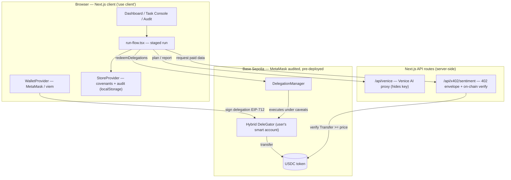

# 04 · Architecture

> A single full-stack **Next.js 16** app. **No separate backend, no custom Solidity.** The backend is
> Next.js API routes; the on-chain contracts are MetaMask's audited, pre-deployed ones on Base Sepolia.

## System overview



The agent's "brain" (Venice AI) and the paid service are reached through **server-side API routes** so
secrets never touch the client. The wallet, the delegation signing, and the redemption happen
**client-side** through MetaMask + viem. The chain layer is entirely MetaMask's pre-deployed contracts.

## Why no custom smart contracts

The two contracts Covenant relies on — the **`DelegationManager`** (validates a delegation + caveats and
executes the redemption) and the **Hybrid DeleGator** smart account — are deployed and **audited by
MetaMask** on Base Sepolia. The caveat enforcers (`ERC20TransferAmountEnforcer`, `TimestampEnforcer`)
are likewise theirs. Covenant deploys **nothing of its own** to the chain; it *composes* these audited
primitives. That is a deliberate trust decision: the hard money-limits are enforced by code that has
been audited, not by us.

## Repository layout

```
src/
├─ app/
│  ├─ page.tsx                         landing (the pitch)
│  ├─ new/page.tsx                     covenant builder — signs the ERC-7710 delegation
│  ├─ dashboard/
│  │  ├─ page.tsx                      overview
│  │  ├─ covenants/page.tsx            covenant list + revoke
│  │  ├─ console/page.tsx              the Task Console (drives a run) + Settlement readiness
│  │  ├─ audit/page.tsx                the audit trail (BaseScan links + on-chain/sim badges)
│  │  └─ services/page.tsx             the x402 service directory
│  └─ api/
│     ├─ venice/route.ts               server proxy to Venice AI
│     └─ x402/sentiment/route.ts       demo paid service — 402 envelope + on-chain verification
├─ lib/
│  ├─ chain.ts                         viem clients, Base Sepolia, USDC address, explorer helpers
│  ├─ smart-account.ts                 toMetaMaskSmartAccount (Hybrid) + deploy via factory
│  ├─ delegation.ts                    createCovenantDelegation + executeCovenantPayment (redeem)
│  ├─ policy.ts                        the payment firewall (evaluatePolicy)
│  ├─ x402.ts                          x402 client — request 402, settle & deliver
│  ├─ venice.ts                        Venice client wrappers (planTask, generateReport)
│  ├─ wallet.tsx                       WalletProvider / useWallet
│  ├─ store.tsx                        StoreProvider / useStore (covenants + audit, localStorage)
│  ├─ seed.ts                          demo covenants, audit, services
│  ├─ types.ts                         shared types
│  └─ utils.ts                         toUnits / fromUnits / shortAddr / uid
└─ components/
   ├─ run-flow.tsx                     the staged run UI (plan → 402 → policy → settle)
   ├─ settlement-readiness.tsx         deploy + fund panel for real on-chain settlement
   ├─ covenant-card.tsx                covenant card
   └─ ui/                              button / toast / confirm / skeleton primitives
```

A module-by-module reference is in [07 · Technical reference](./07-technical-reference.md).

## Tech stack

| Layer | Choice | Notes |
| --- | --- | --- |
| App framework | **Next.js 16** (App Router, `src/`) | One app for UI **and** API routes; React 19. |
| Styling | **Tailwind v4** | Custom `@theme` palette in `globals.css`; tokens, not raw hex. |
| Chain access | **viem** | `publicClient` / wallet client for Base Sepolia. |
| Delegation | **`@metamask/delegation-toolkit@0.13.0`** | Smart account, `createDelegation`, `redeemDelegations`. |
| AI | **Venice AI** | Task planning + report generation, proxied server-side (mock fallback). |
| Network | **Base Sepolia** | OP-stack L2 testnet; **USDC** (6 decimals) is the payment asset. |

## Client/server boundary

- **Client (`"use client"`)** — everything stateful or wallet-touching: the dashboard pages,
  `run-flow.tsx`, `WalletProvider`, `StoreProvider`. The wallet signature and the `redeemDelegations`
  call run here, in the user's browser, through MetaMask.
- **Server (API routes)** — the Venice proxy (keeps `VENICE_API_KEY` off the client) and the x402
  service (issues the 402 envelope and performs the **on-chain payment verification**). Secrets and
  verification logic stay server-side.

## State & persistence (at a glance)

`store.tsx` keeps covenants and the audit log in `localStorage` under **`covenant_state_v2`**, seeding
from `seed.ts` on first load. **Signed delegations are deliberately not persisted** — they live in a
runtime ref and are lost on reload, so a real on-chain redemption only works in the session that created
the covenant. This is a security choice (raw signatures should not sit in `localStorage`), detailed in
[07 · Technical reference](./07-technical-reference.md#state--persistence).

---

**Next:** [05 · How it works →](./05-how-it-works.md)
