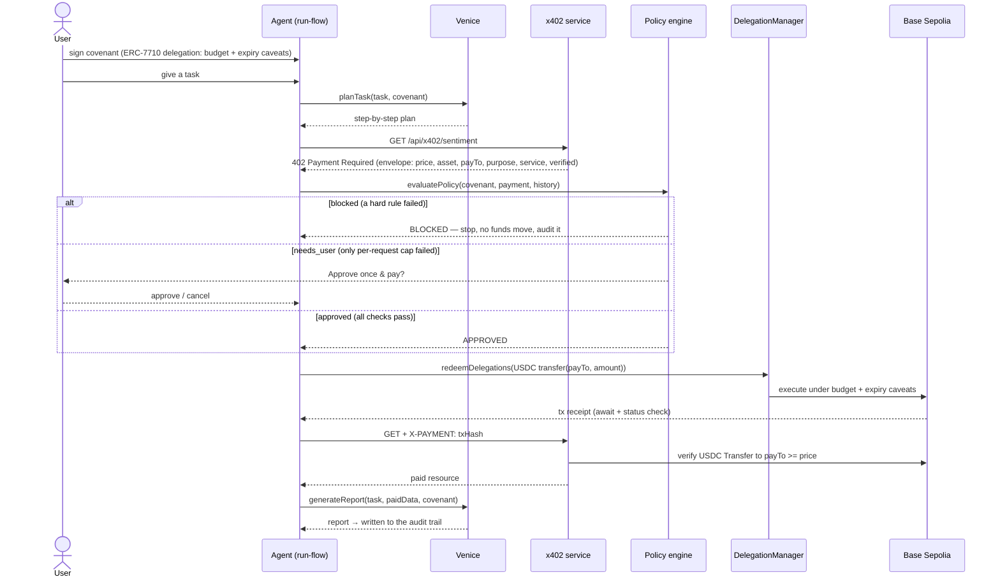

# 05 · How it works

> One run, from "user signs a covenant" to "report + audit." The staged UI in `run-flow.tsx` mirrors
> these steps one card at a time, each with a `real` / `on-chain` / `simulated` badge.

## The end-to-end run



## Step by step

1. **Sign the covenant** (`/new`). `createCovenantDelegation` builds the ERC-7710 delegation with a
   budget scope (`erc20TransferAmount`) and, when an expiry is set, a `timestamp` caveat, then
   `signDelegation` triggers the **real MetaMask EIP-712 signature**. No money moves.
2. **Plan** (`venice.ts` → `/api/venice`). Venice AI turns the task into concrete steps. (Falls back to
   a deterministic plan if no API key.)
3. **Request paid data** (`x402.ts → requestPaidData`). The agent calls the service; it returns
   **`402 Payment Required`** with an x402 envelope. `x402.ts` parses it into a `PaymentRequest`
   (price, asset, `payTo`, purpose, service, verified).
4. **Evaluate policy** (`policy.ts → evaluatePolicy`). Seven checks run against the covenant; the result
   is one of three decisions (below). **This happens before any transaction is built.**
5. **Settle — only if allowed** (`delegation.ts → executeCovenantPayment`). On approval, the agent
   builds a USDC `transfer(payTo, amount)`, redeems it through the `DelegationManager`
   (`ExecutionMode.SingleDefault`), and **waits for the receipt**. A reverted receipt is treated as a
   failed redemption.
6. **Prove + deliver** (`x402.ts → settleAndDeliver`). The agent re-requests the resource with the tx
   hash in `X-PAYMENT`; the server **verifies the USDC transfer on-chain** and returns the data.
7. **Report + audit.** Venice writes the report, the covenant's remaining budget is decremented, and an
   audit entry is recorded (with the on-chain proof and an honest `execMode`).

## The three decisions

`evaluatePolicy` resolves exactly one outcome:

```ts
const allOk    = checks.every(c => c.ok);
const hardFail = !budgetOk || !active || duplicate || !serviceOk || !purposeOk || !verifiedOk;

if (allOk)                       decision = "approved";    // every rule passed
else if (!perReqOk && !hardFail) decision = "needs_user";  // ONLY the per-request cap failed
else                             decision = "blocked";     // a hard rule was violated
```

| Decision | Meaning | What the run does |
| --- | --- | --- |
| **`approved`** | All seven checks passed. | Redeems the delegation and settles immediately. |
| **`needs_user`** | Price is over the per-request cap, **but every other rule passed**. | Pauses and shows **Approve once & pay** / **Cancel**. Approve → settles (audit notes the one-time override). Cancel → recorded as blocked. **No funds move until you approve.** |
| **`blocked`** | At least one *hard* rule failed (budget, service, verified, purpose, duplicate, inactive). | Halts **before** any redemption. No funds move. Records the failing rules. |

The "needs approval" pause is implemented as a promise the staged run awaits; the **Approve once & pay**
/ **Cancel** buttons resolve it. The per-request check still renders a red ✗ even after approval — the
rule genuinely failed; the user simply chose to override it that one time. See the
[security model](./06-security-model.md#soft-vs-hard-the-per-request-override) for why this override is safe.

## Real vs simulated

Covenant is honest about what is on-chain versus simulated, and shows a badge at every step. The
settlement badge is derived as:

```ts
const verified = !!delivery?.verified;                         // server confirmed the USDC transfer
const execMode = redeemMode === "real" && verified ? "real" : "simulated";
```

| Condition | What is real | Badge |
| --- | --- | --- |
| No wallet connected | Nothing on-chain; the flow is demonstrated end-to-end. | `simulated` |
| Wallet on Base Sepolia, covenant signed | Smart-account derivation, the delegation, **all caveats**, and the **EIP-712 signature**. | signature is **real** |
| Above + smart account **deployed & funded** | The `redeemDelegations` tx broadcasts, the receipt is awaited, and the seller verifies the USDC transfer. | `on-chain · verified` |
| Broadcast happened but the seller couldn't verify, or the account is undeployed/unfunded | Delegation + signature still real; settlement falls back. | `simulated` |

The audit log marks an entry `on-chain` **only** when the redemption broadcast succeeded **and** the
seller verified the payment. The transaction field links to BaseScan only for a full, real `0x` hash —
never for a synthetic display string. Nothing pretends to be on-chain when it isn't.

> Want to force honesty even harder? Set `X402_REQUIRE_ONCHAIN=true` and the x402 server keeps the
> paywall (402) up until a payment is **verified on-chain** — see the [demo guide](./09-demo-guide.md).

---

**Next:** [06 · Security model →](./06-security-model.md)
