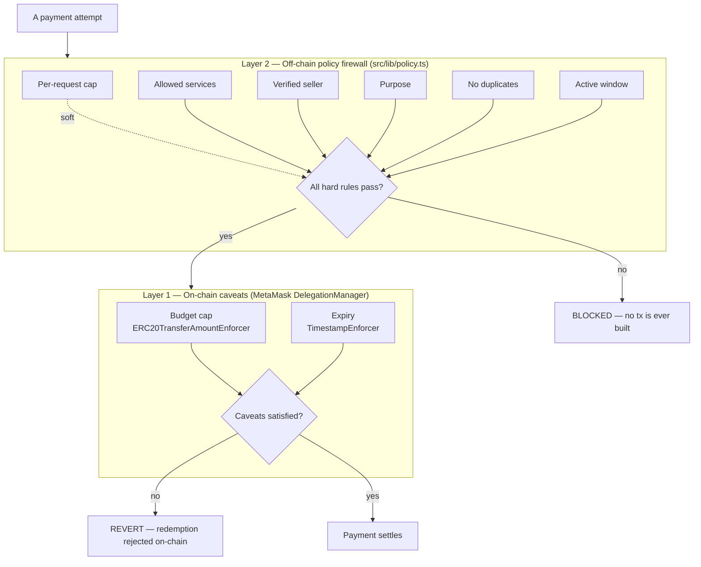

# 06 · Security model

> The heart of Covenant. Two **independent** layers enforce the policy, so a bypass of one is still
> caught by the other — and the hard money-limits live where the agent cannot reach them.

## Two layers of defense

A payment can only happen if **both** layers allow it. The off-chain firewall runs first and stops a
disallowed payment before any transaction exists. If the firewall were somehow bypassed, the on-chain
caveats would still reject a redemption that exceeds the budget or falls outside the time window.

## Layer 1 — On-chain caveats (cryptographic, unbypassable)

These are baked into the delegation the user signs and enforced by MetaMask's audited
`DelegationManager` at redemption time. **They hold regardless of what the agent or our server does.**

| Caveat | Enforcer | Guarantee |
| --- | --- | --- |
| **Total budget cap** | `ERC20TransferAmountEnforcer` | The cumulative USDC redeemed under this delegation can never exceed the budget. |
| **Expiry** | `TimestampEnforcer` (`beforeThreshold`) | A redemption after the covenant window reverts on-chain. |

In code (`src/lib/delegation.ts`), the budget is the delegation `scope`
(`type: "erc20TransferAmount"`, `maxAmount`), and the expiry is a `timestamp` caveat. A signed covenant
therefore carries multiple caveats (verifiable via `delegationSummary().caveats`).

Because these are enforced **outside the agent's trust domain**, they are the limits a prompt injection
or a compromised dependency *cannot raise*. This is the property that makes the worst case bounded:
**worst case, the agent spends the budget, before the expiry, and nothing more.**

## Layer 2 — Off-chain policy firewall

`evaluatePolicy(covenant, payment, history)` is a **pure function** (no side effects) that runs *before*
any redemption. It produces seven checks and one decision:

| Check | Passes when | Type |
| --- | --- | --- |
| Budget remaining | `price ≤ remainingBudget` | Hard |
| Under max per request | `price ≤ maxPerRequest` | **Soft** (overridable once) |
| Service allowed | `payment.service` matches the allow-list (empty = any) | Hard |
| Seller verified | the 402 envelope marked the seller `verified` | Hard |
| Purpose matches | covenant purpose equals the payment purpose | Hard |
| No duplicate payment | no completed audit entry for the same service+resource | Hard |
| Covenant active | status `active` **and** `expiresAt > now` | Hard |

Most failures are a **hard block** — they encode intent the agent must never cross (wrong service,
unverified seller, wrong purpose, replay, revoked/expired). The **only** soft rule is the per-request
cap.

## Soft vs hard: the per-request override

The per-request cap is deliberately *soft*. It is a **friction control** — "don't let the agent quietly
spend more than M per call" — not an absolute prohibition. When a payment fails *only* the per-request
check (and every hard rule passes), the decision is `needs_user`: the run **pauses** and asks the human
to *approve once & pay* or cancel.

This is safe precisely because of Layer 1:

- The human approving a single over-cap payment **cannot** push total spend past the on-chain budget.
- A *malicious* agent cannot turn the pause into a drain — it cannot approve on the user's behalf, and
  even repeated approvals are still capped by the budget caveat.
- The override is logged: the audit entry records "approved by you: a one-time payment over the
  per-request limit," and the per-request check still shows a red ✗ — an honest record that a rule was
  consciously overridden, not silently passed.

In short: **hard limits are cryptographic and final; the one soft limit is a human-in-the-loop speed
bump that the cryptographic limits still contain.**

## Threat model — how each attack is contained

| Threat | Containment |
| --- | --- |
| **Prompt injection** ("send everything to 0xATTACKER") | The recipient/amount come from the verified x402 envelope and the redemption is a `transfer(payTo, amount)` capped on-chain. An injected larger transfer reverts at the budget caveat; an unverified or disallowed recipient is blocked by the policy firewall. |
| **Runaway loop** (thousands of calls) | The on-chain **budget cap** is cumulative — once exhausted, further redemptions revert. The off-chain budget check also blocks once `remainingBudget` is hit. |
| **Stale authority** (acting after the task) | The **expiry** caveat reverts redemptions after the window; the policy `active` check blocks them off-chain too. The user can also **revoke** a covenant. |
| **Wrong/unverified service** | Hard blocks: service allow-list + verified-seller checks. |
| **Replay / double-charge** | Hard block: duplicate check against the audit history. |
| **Compromised app server** | It still cannot exceed the on-chain budget or expiry; the caveats are enforced by the audited `DelegationManager`, not the server. |
| **Over-limit single payment** | Held for explicit user approval (`needs_user`); never auto-charged. |

## Trust assumptions (stated honestly)

- We trust **MetaMask's audited contracts** (`DelegationManager`, DeleGator, the caveat enforcers) to
  enforce the caveats. Covenant deploys no contracts of its own.
- The off-chain checks (service, purpose, verified, duplicate) are enforced by the **client policy
  engine**; they are intent-level guardrails, not cryptographic guarantees. The *cryptographic*
  guarantees are the budget and expiry. This split is intentional and is exactly what
  [§07](./07-technical-reference.md) and the [real-vs-simulated model](./05-how-it-works.md#real-vs-simulated)
  document.
- Signed delegations are **session-scoped** (not persisted) — a security choice that also bounds how
  long signing material lives. See [Technical reference → State & persistence](./07-technical-reference.md#state--persistence).

---

**Next:** [07 · Technical reference →](./07-technical-reference.md)
