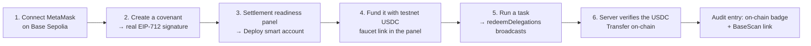

# 09 · Demo guide

> How to run Covenant, the three no-wallet scenarios that show the firewall live, and the full on-chain
> walkthrough. Aim for the two-path demo: **the firewall blocking with no wallet**, then **a real
> on-chain settlement**.

## Setup

```bash
npm install
cp .env.example .env.local   # optional: VENICE_API_KEY for real AI; X402_PAY_TO for the seller
npm run dev                  # http://localhost:3000
```

Open http://localhost:3000 → **Launch the demo**. Everything runs with **no env vars and no wallet**
(Venice falls back to a mock, settlement is clearly badged `simulated`).

## The three decisions, with no wallet

The seed ships three **active** covenants that produce all three decisions against the same 0.25 USDC
demo payment. Go to **Task Console**, pick a covenant, and **Run agent**.

| Covenant | Config | Outcome | Why |
| --- | --- | --- | --- |
| **#001 Research Agent** | allows `market-api.demo`, purpose `research-data-purchase`, max/req **0.50** | ✅ **Approved** | Every rule passes → redeems + settles. |
| **#006 Insights Agent** | same allow-list & purpose, but max/req **0.20** | ⏸️ **Needs approval** | Only the per-request cap fails → **Approve once & pay** / Cancel. |
| **#005 Compliance Bot** | allows only `inference.xyz`, purpose `compliance-audit`, max/req **0.10** | ⛔ **Blocked** | Service, purpose, and per-request all fail (hard block). |

### Scenario A — Approved (the happy path)
Pick **Research Agent (#001)** → Run. Watch the four cards: plan → 402 → policy (all ✓, green
"Approved") → settlement ("Sent 0.25 USDC", badge `simulated` with no wallet). The budget decrements.

### Scenario B — Needs approval (the soft override)
Pick **Insights Agent (#006)** → Run. The policy card shows **one red ✗** on *Under max per request*
and an amber **"Needs your approval"** with **Approve once & pay** / **Cancel**.
- **Approve once & pay** → decision flips to green **"Approved by you,"** the run settles, and the audit
  notes a one-time per-request override (the ✗ stays — an honest record).
- **Cancel** → recorded as **blocked**; no funds move.

### Scenario C — Blocked (the firewall)
Pick **Compliance Bot (#005)** → Run. The policy card lights up **red ✗** on *Service allowed*,
*Purpose matches*, and *Under max per request*; the decision is **"Blocked by covenant — no funds
moved,"** and the run **halts before any redemption**. The attempt is recorded in the **Audit log**.

> Every run ends in the **Audit log** (`/dashboard/audit`): approved entries show an `on-chain` /
> `simulated` badge (and a BaseScan link for real txs); blocked entries show the failing reason. The log
> exports to JSON.

## The full on-chain path (Base Sepolia)

To take a covenant all the way to a **real** settlement:



1. **Connect** MetaMask on **Base Sepolia** and **create a covenant** (`/new`) — this prompts a **real
   ERC-7710 EIP-712 signature**. The signed delegation is held for this session.
2. Open the **Task Console** → the **Settlement readiness** panel appears for the real covenant.
3. **Deploy** the smart account (one ordinary tx from your EOA to the factory; you pay gas — no bundler
   needed).
4. **Fund** the smart account with testnet **USDC** (faucet link in the panel) — at least the
   per-request amount.
5. **Run a task.** The redemption broadcasts, Covenant waits for the receipt, the x402 server verifies
   the USDC `Transfer`, and the audit entry shows an **`on-chain`** badge with a **BaseScan link**.

> **Session note:** signed delegations are not persisted ([why](./07-technical-reference.md#state--persistence)),
> so create the covenant and run the task in the **same browser session**.

## Strict mode — prove the gate is real

Set this in `.env.local` and restart:

```bash
X402_REQUIRE_ONCHAIN=true
```

Now the x402 server keeps the **402 paywall up** until a payment is **verified on-chain**. A simulated
(no-wallet) run will *not* unlock the resource — a clean way to prove that the on-chain settlement gate
is genuinely doing the work.

## Suggested 2-minute demo script

1. **Frame it (15s):** "Agents need to pay autonomously, but a wallet given to an agent is a liability.
   Covenant is the safety layer."
2. **Block (30s):** Compliance Bot → Run → the firewall lights up red and halts. "No transaction was
   ever built."
3. **Approve-once (30s):** Insights Agent → Run → "everything passes except the per-request cap, so it
   asks me" → Approve once & pay → settles. "Soft limit, human speed-bump — but the on-chain budget
   still caps the total."
4. **Happy path + on-chain (30s):** Research Agent → Run (or the deployed/funded on-chain covenant) →
   settles; open the Audit log → BaseScan link. "Budget and expiry are enforced by MetaMask's audited
   contracts, not by us."
5. **Close (15s):** "Two layers — cryptographic hard limits, plus an intent firewall. Worst case, the
   agent spends the budget you set, before the time you set, and nothing more."

---

**Next:** [10 · Hackathon tracks →](./10-hackathon-tracks.md)
