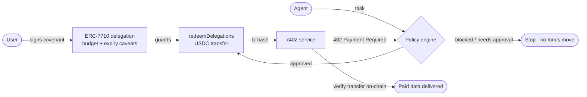

# Welcome

**Covenant is the safety layer for self-paying AI agents.**

Giving an AI agent a wallet is like giving a toddler an uncapped credit card — one prompt injection or
runaway loop can drain it. Covenant fixes that: a user signs **one** spending policy (the *covenant*),
and from then on the agent can pay for [x402](https://x402.org) services autonomously using **ERC-7710
delegated permissions** from a **MetaMask Smart Account** — but it can never step outside that policy.
Even a fully compromised agent cannot exceed the budget or spend after the covenant expires, because
those limits are enforced by MetaMask's audited smart contracts, not by our code.

> **Hackathon tracks:** Best x402 + ERC-7710 · Best Agent · Best use of Venice AI

## The idea in 30 seconds

A user signs a **covenant**: an ERC-7710 delegation from their MetaMask Smart Account to the agent,
carrying two on-chain caveats — a hard **USDC budget cap** and an **expiry**. The agent can then call
paid x402 services and settle them by **redeeming** that delegation. Before any redemption, an
off-chain **policy engine** checks the payment against the finer covenant rules. The budget and expiry
are enforced *cryptographically*; everything else is enforced by the policy engine.

## What makes it different

* **Two independent layers of defense.** A bypass of the off-chain policy is still caught by the
  on-chain caveats, and vice-versa. → [Security model](core-concepts/security-model.md)
* **x402 and ERC-7710 are one transaction, not two features.** The USDC transfer that satisfies x402's
  "prove you paid" is the very transfer constrained by the ERC-7710 caveats. →
  [x402 + ERC-7710](core-concepts/x402-and-erc-7710.md)
* **Honest about what's real.** Every step is badged `on-chain` / `real` / `simulated`; nothing claims
  to be on-chain when it isn't. → [Real vs Simulated](core-concepts/real-vs-simulated.md)
* **No custom smart contracts.** Covenant uses MetaMask's audited, pre-deployed `DelegationManager` and
  DeleGator account on Base Sepolia.

## Start here

| If you want to… | Go to |
| --- | --- |
| Understand the why | [The Problem](introduction/the-problem.md) → [The Solution](introduction/the-solution.md) |
| See it run | [Quickstart](getting-started/quickstart.md) → [Demo Guide](getting-started/demo-guide.md) |
| Read the design | [How It Works](core-concepts/how-it-works.md) → [System Architecture](architecture/system-architecture.md) |
| Judge the hackathon fit | [Tracks & Judging](hackathon/tracks-and-judging.md) |

***

**Stack:** Next.js 16 · React 19 · Tailwind v4 · viem · `@metamask/delegation-toolkit` · Venice AI · Base Sepolia
