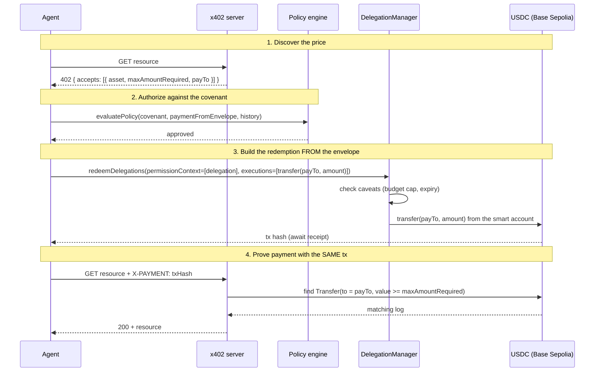

# x402 + ERC-7710

> The integration that defines the project. x402 and ERC-7710 are **not two features bolted together** —
> x402 is the **payment rail** and ERC-7710 is the **guardrail** on it. They share **one transaction**.

## The insight

A naïve integration would treat them as separate: "we support x402 payments" *and* "we use ERC-7710
permissions." Covenant fuses them. The **same USDC transfer** that satisfies x402's *"prove you paid"* is
the very transfer **constrained by the ERC-7710 caveats**. There is exactly one on-chain action, and it
is simultaneously the payment and the thing the covenant guards.

## The loop



## Step 1 — the 402 envelope advertises the payment

`GET /api/x402/sentiment` with no proof returns **402** with an `accepts[]` entry:

```jsonc
{
  "x402Version": 1,
  "error": "Payment Required",
  "accepts": [{
    "scheme": "exact",
    "network": "base-sepolia",
    "maxAmountRequired": "250000",          // 0.25 USDC (6 decimals)
    "resource": "/api/x402/sentiment",
    "payTo": "0x…dEaD",                      // the seller
    "asset": "0x…USDC",
    "extra": { "decimals": 6, "purpose": "research-data-purchase",
               "verified": true, "service": "market-api.demo" }
  }]
}
```

`x402.ts` parses this into a `PaymentRequest`. Note `extra.service`, `extra.purpose`, and
`extra.verified` feed directly into the policy checks, and `payTo` + `maxAmountRequired` + `asset` define
the transfer to build.

## Step 2 — the covenant authorizes it

`evaluatePolicy` checks the parsed payment against the covenant (budget, per-request, **service**,
**verified**, **purpose**, duplicate, active). The envelope's own fields are what make the service,
purpose, and verified checks meaningful — the seller *declares* them and the covenant *decides* whether
they are acceptable. See [Security model](security-model.md).

## Step 3 — the redemption is built *from* the envelope

This is the fusion. `executeCovenantPayment` takes the envelope's `payTo` and amount and constructs the
delegated execution:

```ts
const callData  = encodeFunctionData({ abi: erc20Abi, functionName: "transfer",
                                       args: [payTo, toUnits(amountUSDC)] });
const execution = createExecution({ target: USDC_ADDRESS, value: 0n, callData });

await redeemDelegations(walletClient, publicClient, delegationManager, [{
  permissionContext: [signedDelegation],   // the covenant
  executions: [execution],                 // the USDC transfer FROM the 402 envelope
  mode: ExecutionMode.SingleDefault,
}]);
```

The `DelegationManager` validates the delegation's **caveats** before executing: the
`ERC20TransferAmountEnforcer` rejects the transfer if it would push cumulative spend past the **budget**;
the `TimestampEnforcer` rejects it if the covenant has **expired**. So the x402 payment is *physically
constrained* by the ERC-7710 limits — the rail cannot carry more than the guardrail allows.

## Step 4 — the same tx is the payment proof

The resulting transaction hash is handed back to the x402 server in `X-PAYMENT`. The server
(`verifyPayment`) fetches the receipt and looks for a USDC `Transfer` to `payTo` for **≥ the price**:

```ts
const transfers = parseEventLogs({ abi: erc20Abi, eventName: "Transfer", logs: receipt.logs });
const match = transfers.find(l =>
  l.address.toLowerCase() === USDC_ADDRESS.toLowerCase() &&
  String(l.args.to).toLowerCase() === PAY_TO &&
  (l.args.value as bigint) >= priceUnits(PRICE_USDC));
```

If the transfer is there, the resource is delivered with `settlement: "on-chain"`. The proof is not a
trusted header value — it is **the on-chain effect of the ERC-7710 redemption**, verified independently
by the seller.

## Why this is the right way to combine them

| If they were separate… | Because they're fused… |
| --- | --- |
| You'd pay, then *separately* hope an ERC-7710 limit applied. | The payment **is** the redemption; the limit is enforced on the exact transfer. |
| The proof could be a fabricated header. | The proof is a real on-chain transfer the seller re-verifies. |
| The budget could be evaded by paying out-of-band. | There is no out-of-band path — every payment goes through `redeemDelegations`. |
| x402 "support" and ERC-7710 "support" are two checkboxes. | One transaction satisfies both specs at once — that's the integration. |

This is what the **Best x402 + ERC-7710** track is asking for: not two integrations side by side, but a
design where the payment rail and the permission system are the same motion. →
[Tracks & Judging](../hackathon/tracks-and-judging.md).
