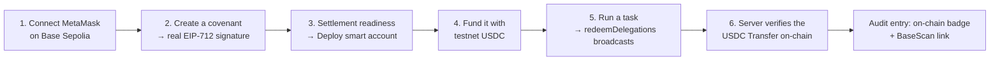

# Going On-Chain

> How to take a covenant from a real signature all the way to a **real on-chain settlement** on Base
> Sepolia — deploy, fund, run, verify.

## What "real" requires

A covenant's redemption only **truly settles on-chain** when:

1. The smart account is **deployed**, and
2. It holds enough **USDC** to make the payment.

Until then, the signature and delegation are still real, but settlement falls back to `simulated` (see
[Real vs Simulated](../core-concepts/real-vs-simulated.md)). The **Settlement readiness** panel in the
Task Console surfaces both prerequisites and lets you fix them.

## The path

### 1. Connect

Connect MetaMask on **Base Sepolia**. The header shows the connected account and the derived smart
account.

### 2. Create a covenant

Go to **New covenant** (`/new`), set the budget, window, per-request cap, allowed services, and purpose,
and sign. This prompts a **real ERC-7710 EIP-712 signature**. The signed delegation is held **for this
session** (it is not persisted — [why](../architecture/technical-reference.md#state--persistence)).

### 3. Deploy the smart account

Open the **Task Console** → the **Settlement readiness** panel appears for the real covenant. Click
**Deploy**. The owner EOA sends **one ordinary transaction** to the account factory (you pay gas) — **no
ERC-4337 bundler needed**. Deployment is required because the `DelegationManager` must call into a
deployed delegator to execute the transfer.

### 4. Fund it

The panel shows the smart account's USDC balance with a **Fund** (faucet) link. Send it at least the
per-request amount of testnet **USDC**.

### 5. Run a task

Run any in-policy task. `executeCovenantPayment` builds the USDC transfer, calls `redeemDelegations`
through the `DelegationManager`, and **waits for the receipt**. The caveats (budget, expiry) are
enforced on-chain during this step.

### 6. Verify

The agent re-requests the resource with the tx hash in `X-PAYMENT`; the x402 server finds the USDC
`Transfer` to the seller and confirms it. The **Audit log** entry now shows an **`on-chain`** badge and a
**BaseScan link** to the real transaction.

## Tips & gotchas

* **Same session.** Create the covenant and run the task in the **same browser session** — signed
  delegations are not persisted.
* **Strict proof.** Set `X402_REQUIRE_ONCHAIN=true` to make the x402 server *refuse* to deliver until a
  payment is verified on-chain — proving the gate end-to-end.
* **Caveats are real.** Try a task that would exceed the on-chain budget; the redemption reverts at the
  `ERC20TransferAmountEnforcer`, independent of the off-chain checks.
* **Gas.** The owner EOA needs a little Base Sepolia ETH for the deploy + redemption transactions.

## Next

* Why each step is badged the way it is → [Real vs Simulated](../core-concepts/real-vs-simulated.md)
* The exact functions involved → [Technical Reference](../architecture/technical-reference.md)
