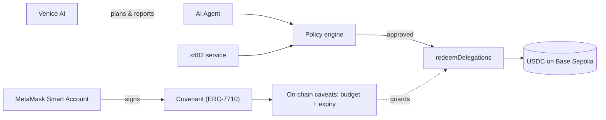

# Overview

> A one-page tour of what Covenant is, who it's for, and how the pieces fit. For the deeper "why,"
> continue to [The Problem](the-problem.md) and [The Solution](the-solution.md).

## What is Covenant?

Covenant is a **safety layer for autonomous AI agents that need to spend money**. It lets an agent pay
for [x402](https://x402.org) web services on its own, while guaranteeing the agent can only ever spend
**inside a policy the user signed once** — the *covenant*.

Technically, a covenant is an **ERC-7710 delegation** from the user's **MetaMask Smart Account** to the
agent's executor, carrying on-chain **caveats** (a USDC budget cap and an expiry) plus an off-chain
policy (allowed services, purpose, per-request cap, and more). The agent pays by **redeeming** that
delegation; a **policy firewall** vets every payment first.

## Who is it for?

| Audience | Why they care |
| --- | --- |
| **Users delegating to agents** | Sign once, then let an agent work unattended with a hard guarantee on the worst case. |
| **Agent / framework builders** | A drop-in pattern for safe, autonomous, non-custodial payments. |
| **x402 service providers** | A paying client whose payments are verifiable on-chain. |
| **Hackathon judges** | A substantive composition of x402 + ERC-7710, not two checkboxes. |

## How the pieces fit

* **MetaMask Smart Account** — holds the user's funds; signs the covenant. Nothing is custodied by us.
* **ERC-7710 delegation + caveats** — the cryptographic budget and expiry the agent cannot exceed.
* **Policy engine** — the off-chain firewall enforcing intent-level rules before any payment.
* **x402 service** — the paid API; issues a `402` envelope and verifies payment on-chain.
* **Venice AI** — the agent's planner and report writer.
* **Base Sepolia + USDC** — the chain and the settlement asset.

## The guarantee, in one sentence

> **Worst case, the agent spends the budget you set, before the time you set, and nothing more** — even
> if it is fully compromised.

## Where to go next

* New to the space? → [Background](background.md)
* Want the motivation? → [The Problem](the-problem.md) · [The Solution](the-solution.md)
* Want the mechanics? → [How It Works](../core-concepts/how-it-works.md)
* Want to run it? → [Quickstart](../getting-started/quickstart.md)
